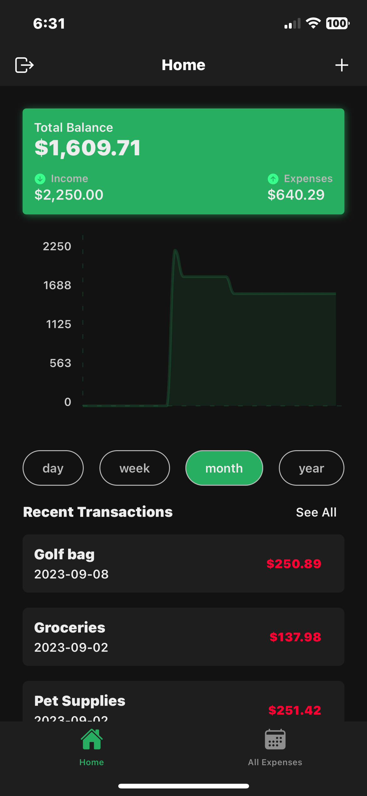
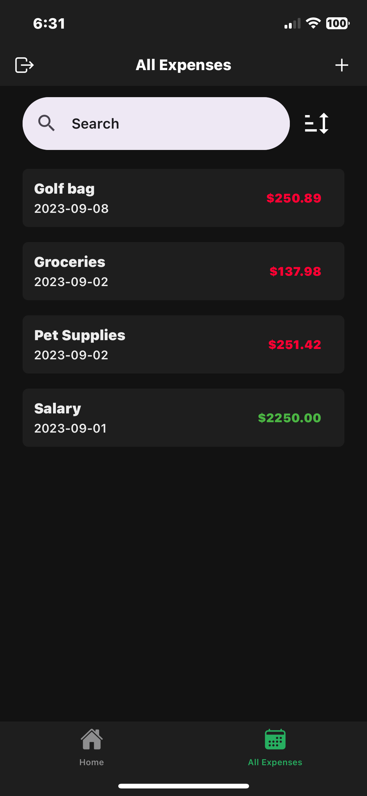
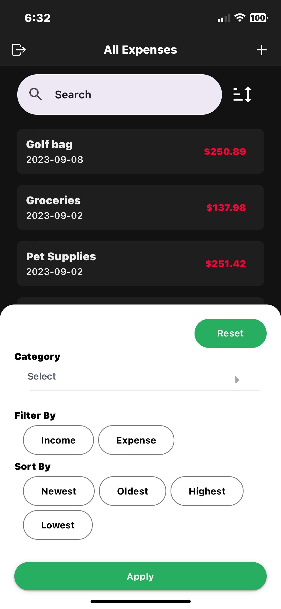
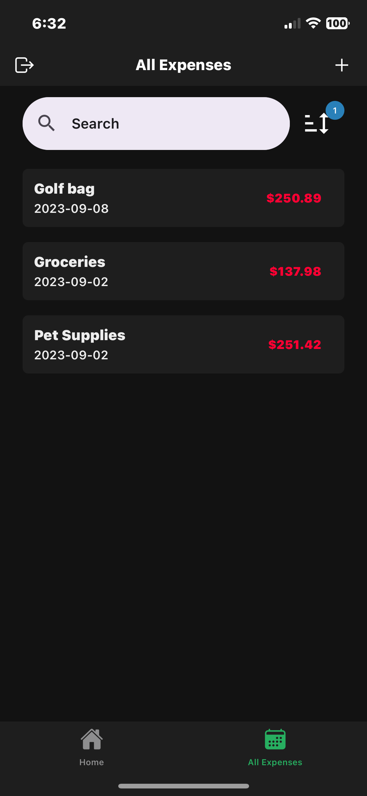
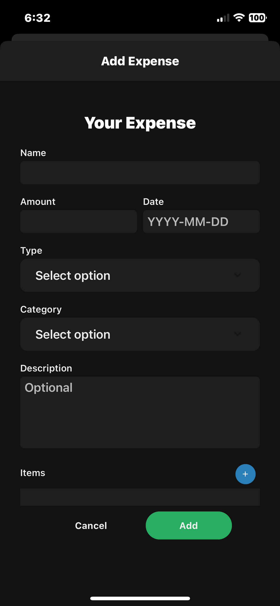
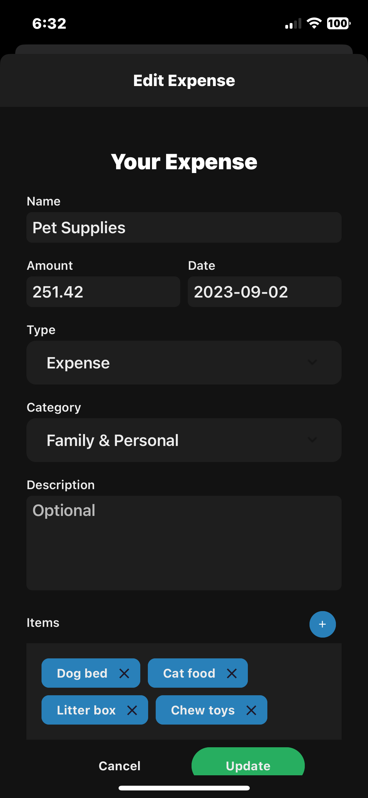

# Expense Tracker

This simple Expense Tracker app is a seamless and intuitive mobile application using React Native and the Expo workflow, for managing your expenses and transactions effectively. The app is crafted to provide you with a simple but comprehensive view of your finances at your fingertips.

## 🌟 Features

- 📊 **Dynamic Graphical Views**: Understand your spending habits with intuitive graphs, representing daily, weekly, monthly, and yearly trends.
- 🔍 **Advanced Sorting & Filtering**: Easily sort and filter through your transactions to find the information you need quickly.
- 🏦 **Multiple Transaction Management**: Record all your income and expenditure under various categories.
- 🌐 **Cross-Platform**: Built with React Native Expo, this app can run on both iOS and Android platforms.
- 🛠 **Intuitive UI/UX**: User-friendly interface for an enhanced user experience.

## 🖼 Screenshots

<table>
  <tr>
    <td>
      
    </td>
    <td>
      
    </td>
    <td>
      
    </td>
  </tr>
  <tr>
    <td>
      
    </td>
    <td>
      
    </td>
    <td>
      
    </td>
  </tr>
</table>

## 🚀 Getting Started

### Prerequisites

- [Node.js](https://nodejs.org/en/)
- [Expo CLI](https://docs.expo.dev/get-started/installation/)
- [npm](https://www.npmjs.com/)

### Installation

1. Clone the repository:
   - `git clone https://github.com/thimer-logan/ExpenseTracker.git`
2. Install Dependencies:
   - Navigate to the project directory and run `npm install`
3. Start the Expo development server:
   - run `npx expo start`
